# MacPulse Widget

原生 macOS 资源监视、可选菜单栏监控与桌面小组件。查看各核心 CPU、进程内存、目录容量、电池与进程 CPU 能耗，并由用户选择退出进程。资源监视使用普通窗口，不会置顶。

当前版本：**3.4.0**。安装后的应用和小组件名称均为 **“系统状态”**。

## 下载安装

**[下载安装包：MacPulse Widget 3.4.0（M 系列 Mac）](https://github.com/qwer8856/MACPulse-widget/releases/download/v3.4.0/MACPulse-Widget-v3.4.0-macOS-arm64.zip)**

[版本发布页与校验文件](https://github.com/qwer8856/MACPulse-widget/releases/tag/v3.4.0)

需要 Apple Silicon Mac（M 系列）和 macOS 14 或更新版本。

1. 从 [Releases](https://github.com/qwer8856/MACPulse-widget/releases) 下载并解压 ZIP 安装包。
2. 将“系统状态.app”拖入“应用程序”文件夹并打开。
3. 在“总览与设置”中按需开启“在菜单栏显示”，分别勾选 CPU、内存、磁盘、功率，可任意组合。
4. 需要桌面小组件时，在桌面空白处右键，打开“编辑小组件”，搜索 **“系统状态”**，选择尺寸并添加。
5. 需要自动运行时，勾选“登录时自动启动”；不需要时取消勾选。

更新时先退出“系统状态”，下载新版替换“应用程序”中的旧版并启动。相同应用与小组件标识通常可保留原有桌面小组件和显示设置。

当前安装包使用本地临时签名，未经 Apple 开发者签名和公证，首次打开可能被 macOS 安全策略拦截。仅在本机验证过，其他机型的功率数据支持情况可能不同。

## 资源监视

| 页面 | 内容 |
| --- | --- |
| 总览与设置 | 左侧集中显示 CPU、内存、磁盘、功率与电池状态，右侧为菜单栏、自启设置和系统工具 |
| CPU | 总体利用率，默认按 CPU 占用从高到低排列的进程 |
| 内存 | 总内存比例、应用/固定/压缩内存、交换空间、内存压力，按内存用量降序的进程及占比 |
| 磁盘 | 手动选择目录扫描，按已分配容量降序查看子项目及占比，可进入子目录、取消扫描或在 Finder 中定位 |
| 电池与能耗 | 电池电量、供电与充电状态、系统可提供的预计剩余时间和健康状态，按 CPU 能耗估算降序排列进程 |

资源窗口不显示各核心 CPU 图表；核心数量与各核心占用保留在菜单栏的 CPU 子菜单中。窗口采用紧凑布局，支持调整大小。

内存、磁盘、电池和功率在资源总览、对应详情页及菜单栏子菜单中使用进度条并保留数值。内存和磁盘表示已用比例，电池表示剩余电量。功率条以 W 为单位，从 0–20 W 起步，超过刻度时向上扩展，运行期间不随读数下降而缩小；刻度上限不是设备额定功率，也不代表“功率利用率”。无电池、等待采样或功率读数过期时显示灰色条及状态文字。

进程列表支持按名称或 PID 搜索，点击列标题可切换排序。系统可能限制部分进程的读取权限，底部显示可读取进程数量。

选择可操作的进程后，点击退出或强制退出按钮，再确认操作。普通退出会向应用请求退出或发送终止信号；强制退出可能丢失未保存内容。操作前重新核对进程身份，保护系统进程、其他用户进程和监视程序自身。应用不会自动结束进程或删除文件。

磁盘扫描按需执行，不会每秒扫描整个磁盘；关闭窗口会取消正在进行的扫描。

## 菜单栏与自动启动

菜单栏的 CPU、内存、磁盘、功率复选框支持**一次展开连续多选**，选择一项不会自动关闭菜单。全部取消时仅显示图标。展开期间固定顶部项目宽度，关闭菜单后应用新的显示组合；菜单中的采样数值继续更新。选择结果与窗口同步并保存。

**主菜单每个指标右侧都有原生展开箭头**。选择 CPU、内存、磁盘、功率或电池，才展开对应子菜单；主菜单只保留概要，底部不再常驻显示 CPU 图表或电池详情。系统根据屏幕剩余空间决定子菜单展开方向。

| 子菜单 | 展开后显示 |
| --- | --- |
| CPU | 逻辑核心数量、各核心百分比、CPU 进程排名 |
| 内存 | 总体比例、应用/固定/压缩内存、交换空间、各进程内存和占比排名 |
| 磁盘 | 总容量、已用/可用容量，以及按需扫描的目录容量与占比 |
| 功率 / 电池 | 电量、充电/供电状态、系统提供的预计时间与健康信息、供电功率和进程 CPU 能耗排名 |

子菜单中的进程表支持搜索、排序和滚动。需要退出进程时，点击底部“资源监视”会直接打开对应页面，再选择进程并确认退出。磁盘子菜单可扫描当前目录、进入子目录、取消或定位文件；选择其他目录时会打开系统目录选择器，选定后开始扫描，再次展开磁盘子菜单查看结果。收起主菜单会取消菜单中正在进行的扫描。

无内置电池的 Mac 会明确显示“无电池”。菜单不包含“刷新小组件”和“查看小组件状态”入口，资源窗口也不显示手动刷新小组件按钮。

菜单栏和登录启动默认关闭，由用户自行选择。未启用菜单栏时，关闭资源窗口即退出应用；启用后，关闭窗口保留菜单栏监控。资源窗口关闭或最小化且菜单收起时停止详细采样；再次打开窗口或展开菜单后恢复。

自启使用 macOS 原生登录项，可在应用内取消，也可在“系统设置 → 通用 → 登录项与扩展”管理。开关显示系统实际状态；如显示“待批准”，点击齿轮进入系统设置确认。登录启动时，已启用菜单栏则仅显示菜单栏，否则打开资源窗口。手动打开应用会显示窗口。

## 刷新频率

- **资源监视与菜单栏约每秒采样一次**，菜单展开期间也会更新。仅展开菜单时，各核心与电池信息仍会持续采样；打开后的首个 CPU 采样间隔可能显示 `--`。
- **真正的 WidgetKit 桌面小组件无法保证每秒刷新。** 应用内置了 1 秒后的刷新请求，但实际执行由 macOS 的刷新预算、节能策略和可见状态决定；没有公开接口能强制每秒采集并重绘。
- 计时文本的自动变化不等于 CPU、内存数据重新采样。
- 功率传感器自身可能约一分钟才更新一次；程序每秒读取不代表传感器每秒产生新值。超过 3 分钟的功率读数会隐藏，超过 15 分钟的整份小组件采样显示“等待更新”。
- 应用退出后，桌面小组件仍由系统独立调度。不同显示位置采样时间不同，读数可能暂时不同。

## 数据口径

| 指标 | 统计方式与限制 |
| --- | --- |
| 总 CPU / 各核心 | 总览为全核心平均占用，每个逻辑核心独立统计，范围 0–100% |
| 进程 CPU | 单个核心满载为 100%，多核进程可超过 100%；按进程 CPU 时间增量和实际采样间隔计算 |
| 总内存 | 应用内存、系统固定内存与压缩池实际大小之和，排除文件缓存和可清除匿名页；判断是否紧张需结合内存压力 |
| 进程内存 | 系统提供的进程物理内存占用（phys_footprint），占比为该值除以本机物理内存；各进程相加不等于总览内存 |
| 磁盘总览 | 内置 APFS 主容器总容量减去共享可用空间，单位 GB |
| 目录容量 | 已分配磁盘块，不是文件逻辑大小；占比相对于本次成功统计的容量，不是整块磁盘容量 |
| 供电功率 | 设备供电侧遥测，单位 W，不是累计耗电量，不含外接显示器，部分机型或电池供电时不可用 |
| 进程 CPU 能耗 | 系统进程 CPU 能量计数增量除以采样时间，单位 W；仅为 CPU 部分的估算，不含 GPU、磁盘、网络和显示器，不等同于活动监视器的“能耗影响” |

目录扫描包含隐藏项目，不跟随符号链接、不跨卷，硬链接按同一文件去重并归入先扫描到的项目。权限不足、扫描取消或扫描中均会显示相应状态；结果可能不完整。APFS 克隆共享块和快照可能使扫描合计与实际可释放空间不同。

进程能耗依赖系统和硬件支持，不支持时显示 `--`。无内置电池的桌面 Mac 显示“无内置电池”；电池时间和健康信息以系统可提供的数据为准。本机为无内置电池的 Mac，笔记本电池解析使用样本测试，尚未在真实笔记本上验证充放电状态。

程序不联网、不记录运行日志，不需要辅助功能或录屏权限。用户选定的目录可能需要 macOS 文件访问授权。

## 示例图片

以下为原生视图生成的预览。CPU、内存和能耗采用本机采样；目录页使用测试目录。数值随设备与运行状态变化。

### 资源监视

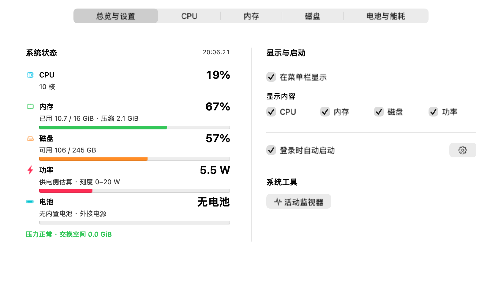
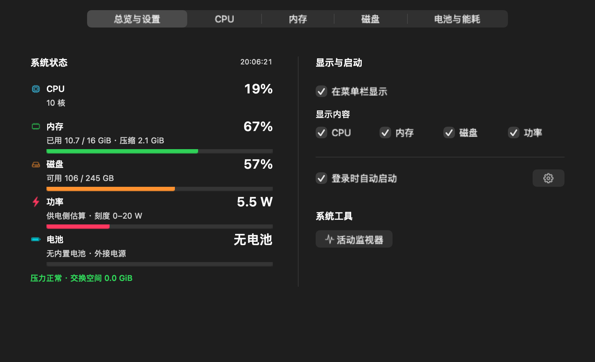

### CPU、内存、磁盘与能耗

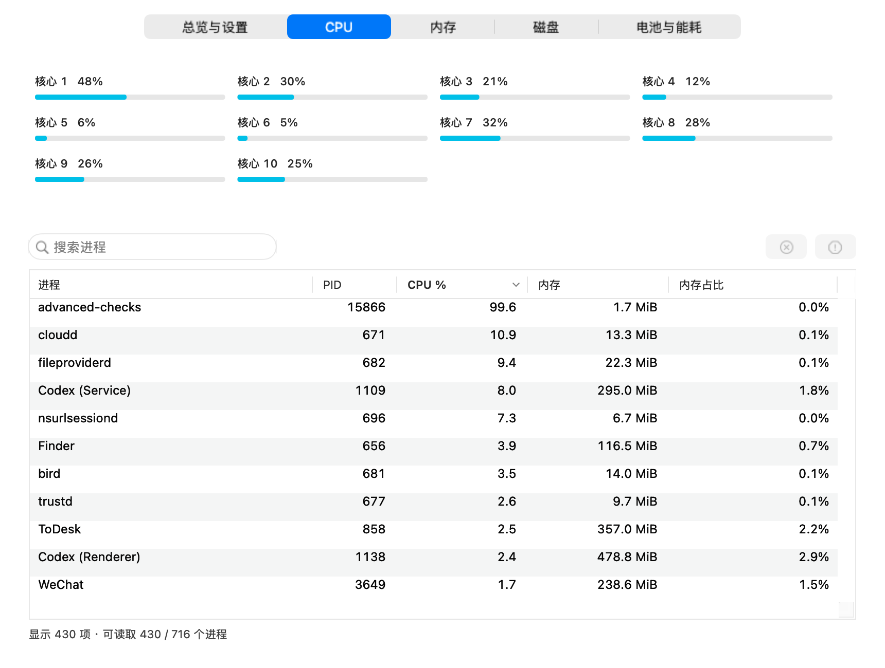
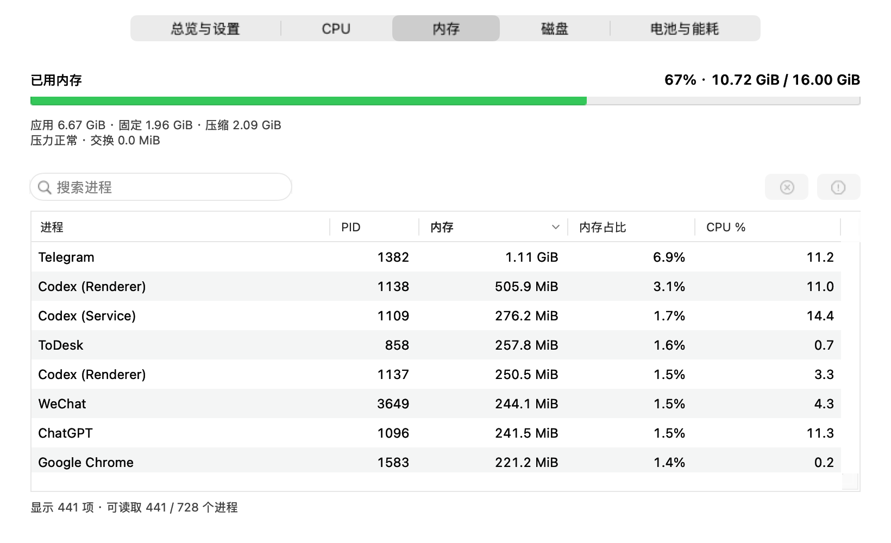
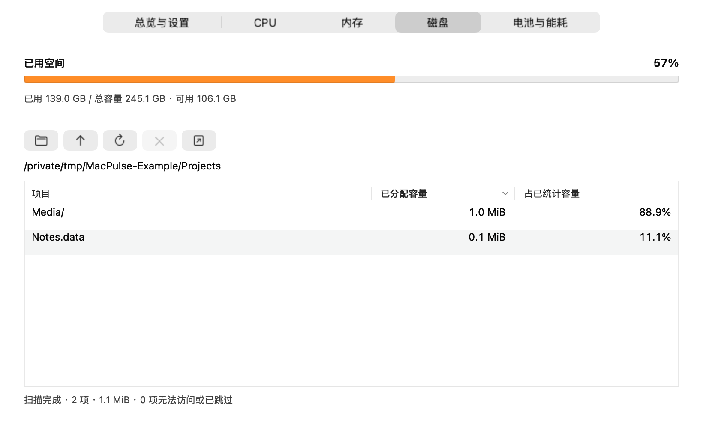
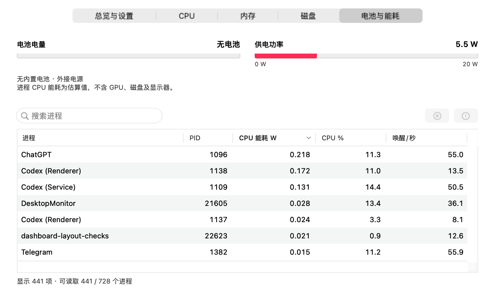

### 菜单栏详情与连续多选

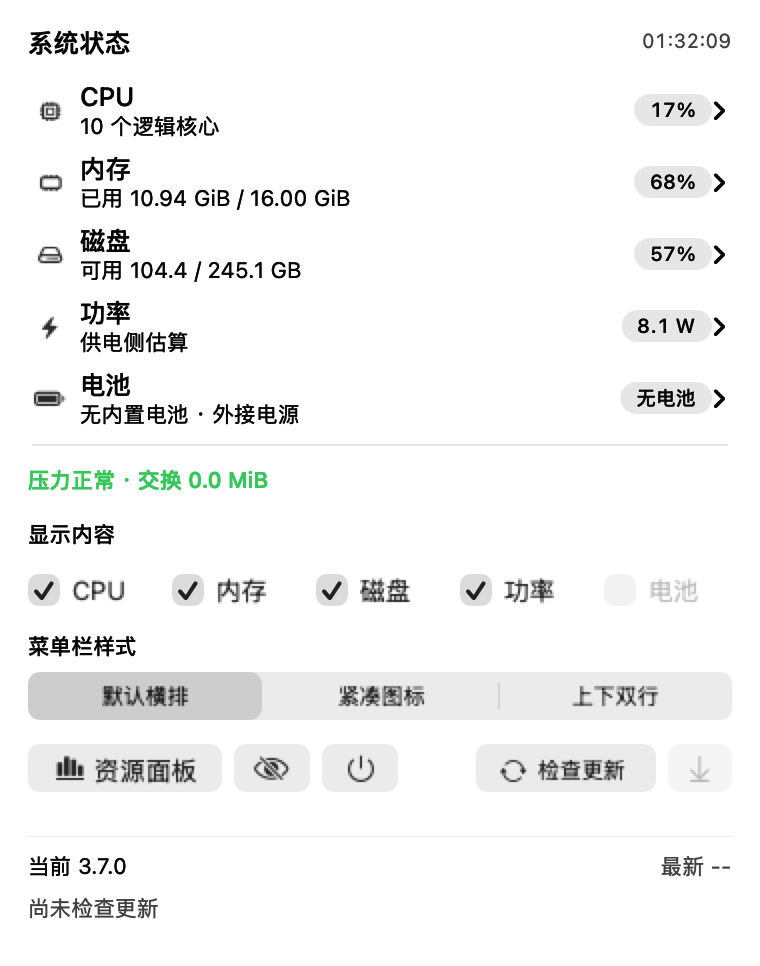
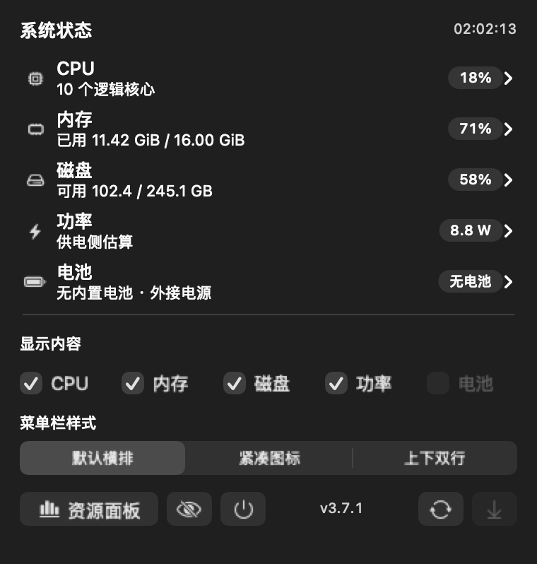

### 按指标展开

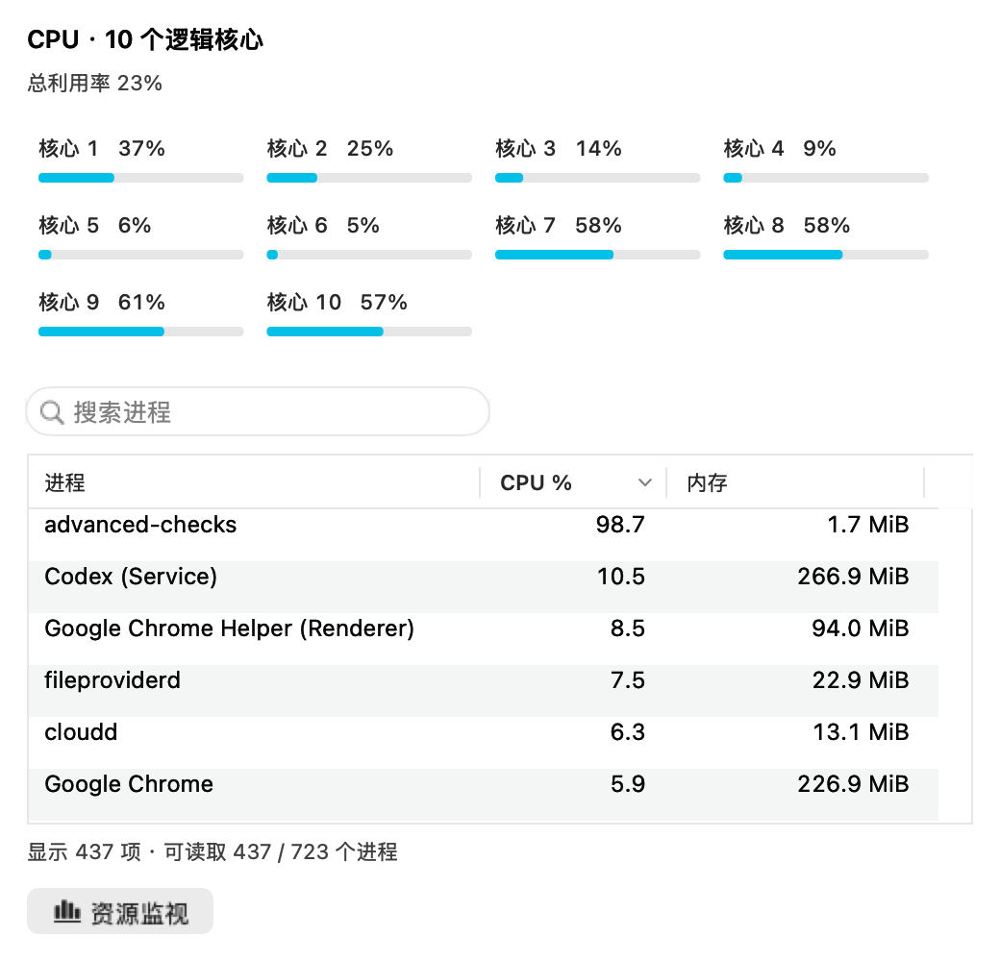
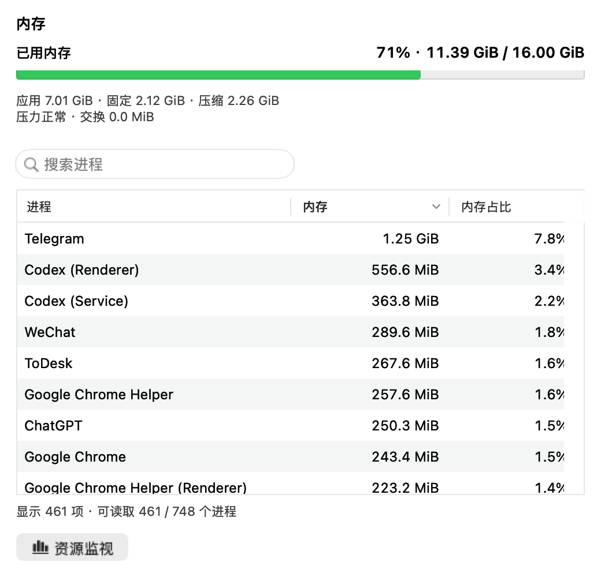
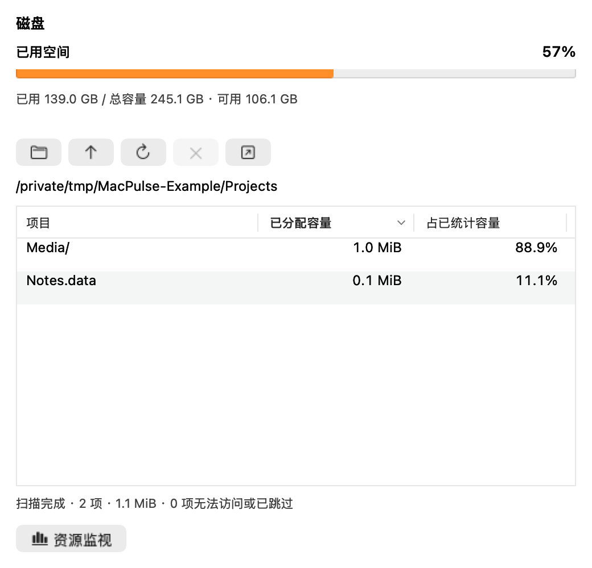

### 桌面小组件

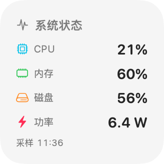
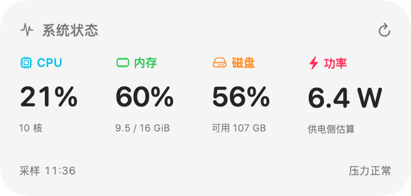
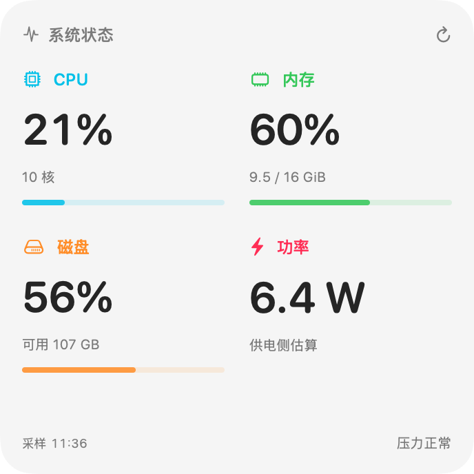
